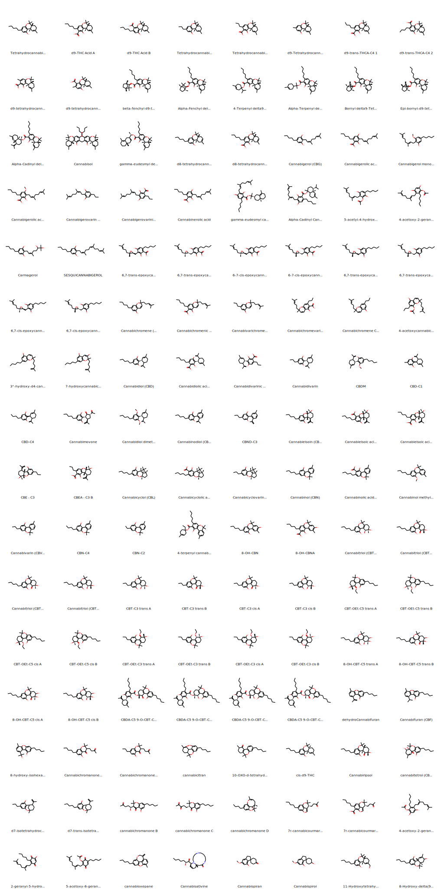

# phytocann_smiles
SMILES codes for the phytocannabinoids from [El Sohly and Gul*](https://books.google.com.au/books?hl=en&lr=&id=uu5wBAAAQBAJ&oi=fnd&pg=PA3&dq=constituents+of+cannabis+sativa+2014&ots=20VjTtMya3&sig=q34pqoO3lhDQiZtLa5ElttAWrs0&redir_esc=y)

These were transcribed into ChemDraw by hand and then converted to SMILES codes. Visualization is with RDKit.

*ElSohly, Mahmoud, and Waseem Gul. "Constituents of cannabis sativa." Handbook of cannabis 3 (2014): 1093.

If you use these in scientific research and need to cite them, you can use the DOI: 

